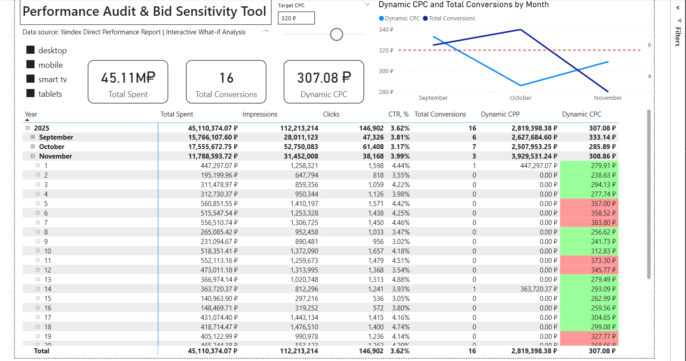
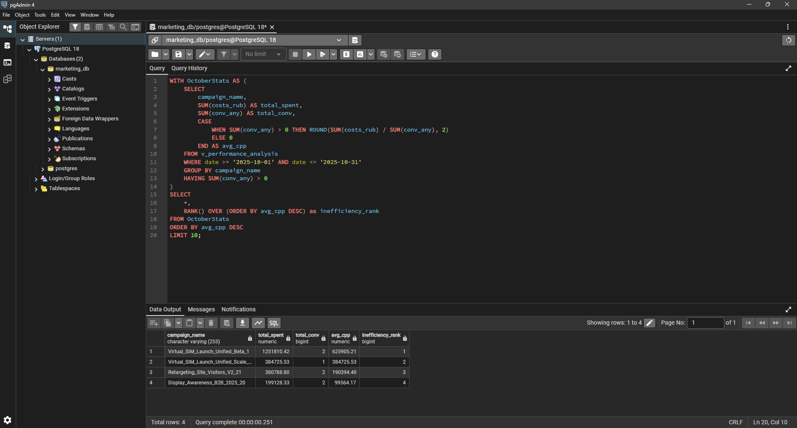

[Read in English](README.md) | [Читать на русском языке](README.ru.md)

# Performance Audit & Bid Sensitivity Tool

## 📊 Project Overview
This project demonstrates a tactical approach to marketing analytics using a **Modern Data Stack (PostgreSQL + Power BI)**. It transforms a large-scale daily performance export from **Yandex Direct** (B2B segment) into an interactive decision-support tool for bid optimization and creative auditing.

### Key Features:
* **SQL-Driven ETL:** Data cleaning and metric calculation (CPC, CPP, CR) performed at the database level for maximum performance.
* **Data Integrity QA:** Automated detection and removal of tracking anomalies (e.g., ghost clicks without impressions).
* **Bid Sensitivity Analysis:** Interactive "What-if" parameters allowing users to dynamically set Target CPC thresholds.
* **Visual Alert System:** A matrix-based "Traffic Light" indicator that highlights underperforming campaigns in real-time.

---

## 🖼️ Dashboard & Logic Previews

### 1. Interactive Performance Audit
The main interface allows managers to drill down from dates to specific campaigns, with instant visual feedback on cost efficiency.

### 2. SQL Data Engineering
A robust semantic layer built in PostgreSQL to ensure a "Single Source of Truth" before data reaches the BI layer.

---

## 🛠️ Tech Stack
* **Database:** PostgreSQL (Data Storage & Transformation).
* **BI Tool:** Microsoft Power BI (Import Mode).
* **Languages:** SQL (PostgreSQL), DAX (Advanced Modeling).
* **Concepts:** Data Validation, Semantic Modeling, Sensitivity Analysis.

---

## 🚀 Project Architecture
1.  **Extraction:** Raw CSV data containing 260k+ rows of daily performance metrics.
2.  **Engineering (SQL):** * Schema setup and data ingestion.
    * Cleaning "Ghost Clicks" (14 rows with 0 impressions but >0 clicks).
    * Creation of an Analytical View to calculate aggregate-ready metrics.
3.  **Visualization (Power BI):** * Connecting to PostgreSQL View.
    * DAX measures to prevent "Mean of Means" errors.
    * What-if parameter integration for dynamic thresholding.

---

## 🧠 Analytical Insights
By implementing a dynamic **Target CPC slider**, the tool reveals how a 10% decrease in maximum bid affects the visibility of "High-CPP" segments. This allows for surgical optimization of ad spend without losing conversion volume in profitable niches.
